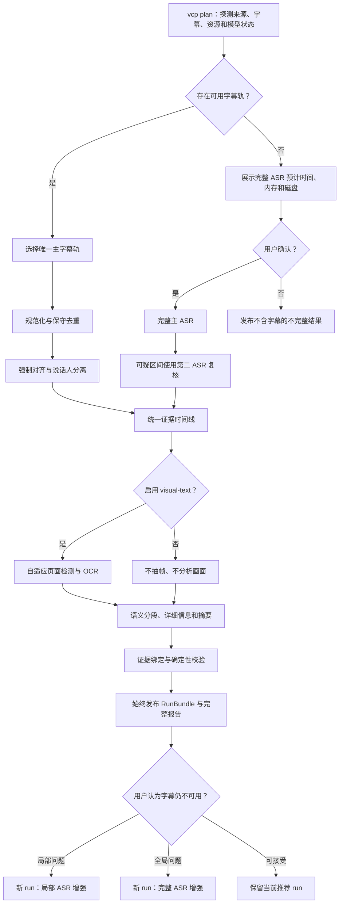

# Video Content Pipeline 详细阶段执行方案

版本：`0.1`

日期：`2026-08-02`

当前项目阶段：`source_intake_planning_and_resource_estimation / completed`

开发完成后的目标阶段：`real_world_testing`

生产状态：`尚未完成真实视频验收，不得标记为 production_validated`

## 1. 方案目标

在以下唯一项目根目录内构建一套免费、本地运行、可审计、可恢复的视频内容处理
流水线：

`/Users/shangyang/Desktop/workspace/projects/video-content-pipeline`

流水线接收本地视频、音频或公开 HTTP(S) 视频链接，面向所选内容总时长为
0 至 4 小时的单视频或多 P 合集，产出：

- 来源字幕整理版或完整 ASR 逐字稿。
- 适合阅读的字幕。
- 按语义自然断开的详细内容报告。
- 问答、人物角色、数字、例子、限定条件和未解决问题等结构化信息。
- 章节摘要和全局摘要。
- 完整的质量、处理、资源、文件和清理报告。

首版坚持来源内总结，不进行外部事实补充或事实核查。所有正式事实性内容必须能
追溯到字幕、ASR 或显式启用后的 OCR 证据。

## 2. 已锁定的产品边界

### 2.1 默认处理策略

1. 有可用字幕轨时，优先使用字幕轨。
2. 字幕优先运行默认不做完整 ASR。
3. 字幕优先运行默认执行字幕文本与音频的强制对齐。
4. 字幕轨没有说话人信息时，默认执行本地说话人分离，但不据此猜测真实姓名。
5. 用户查看结果后，可以显式启动局部 ASR 或完整 ASR 增强运行。
6. 没有可用字幕轨时，完整 ASR 是获得字幕的必需阶段，但必须先展示计划并得到
   用户确认。
7. OCR 和页面变化检测默认关闭，只能由用户显式启用。
8. 通用视觉理解、人物/动作描述和视觉摘要不属于首版必需能力。

### 2.2 模型和资源边界

- 任一生成式模型的参数规模不得超过 8B。
- 同一时间只加载一个大模型。
- ASR、强制对齐、说话人分离、OCR 和文本模型串行调度。
- 单次运行的目标峰值统一内存不超过约 24 GB，为 macOS 和其他进程保留余量。
- 优先使用质量更好的 8-bit 配置；只有内存估算或实测超限时才使用 4-bit。
- 4-bit 质量不合格且 8-bit 超过内存门禁时，不强行运行该配置，改为评估其他
  不超过 8B 的候选模型。
- 不使用付费 API。
- 模型下载必须单独确认，固定 revision 和哈希，下载一次后重复使用。
- 正式运行禁止模型或库自动联网下载缺失文件。

### 2.3 内容范围

正式支持：

- 中文、英文和中英混说。
- 讲座、课程、访谈、播客视频、产品讲解和普通口播。
- 已结束的直播连麦答疑或本地录制。
- PPT、白板、文档、网页和软件界面中的文字，但仅在启用 `visual-text` 时处理。
- 单视频与有明确顺序的多 P 合集。

有限支持：

- 视频内播放的其他视频，只保留外层时间轴；在启用画面分析时尝试标记内嵌区间，
  不递归下载或重建内层时间轴。
- 电影、体育、游戏、快速剪辑等内容只保证语音和显式文字，不保证动作级视觉
  完整性。
- 方言在真实样本验证前标记为实验能力。

首版不支持：

- 正在进行中的实时直播。
- DRM、付费墙、CAPTCHA、登录态、私有链接或需要浏览器 Cookie 的内容。
- 点击序列、鼠标轨迹、快捷键和细粒度操作步骤还原。
- 实物动作级还原。
- 歌词级识别承诺。
- 正式结果截图。
- 通用画面描述和无来源的视觉推断。
- 外部事实补充、联网搜索或自动事实核查。

### 2.4 内容模式和输出语言

每个 Part 可以随时间切换 `ContentMode`，不能只给整段视频贴一个标签：

| ContentMode | 首版能力级别 | 说明 |
|---|---|---|
| `direct_speech` | `full` | 普通口播、演讲和课程语音 |
| `dialogue` | `full` | 访谈和直播答疑；严重重叠处可局部降级 |
| `presentation` | `full` 或 `transcript_only` | 启用 visual-text 时包含页面文字，否则只处理语音/字幕 |
| `screen_demo` | `partial` | 可处理语音和启用后的 OCR，不承诺操作步骤 |
| `embedded_media` | `partial` | 只使用外层时间轴，记录归属和置信度 |
| `physical_action` | `transcript_only` | 不描述或还原细粒度动作 |
| `music_performance` | `transcript_only` | 不承诺歌词识别 |
| `transition` | `full` | 只作为边界和状态证据，不生成通用视觉描述 |
| `unknown` | `manual_review` | 仍发布可用证据，并标记待复核 |

内嵌媒体不建立第二条时间轴。启用相关分析时，可以记录：

- `container_context`
- `embedded_content`
- `audio_source=host|embedded|mixed|unknown`
- 时间范围和归属置信度

全屏、清晰且无主持人叠加的内嵌片段可以局部提高分析能力；混合画面或混音仍保持
`partial`。系统不搜索、下载或恢复被播放视频的原始来源。

输出语言规则：

- `source`、`enhanced` 和 `verbatim` 字幕保持来源语言。
- 中英混说在字幕中保持中英混合。
- 详细信息、章节标题和摘要默认使用中文。
- 不把中文翻译混入来源字幕。
- 将来如支持翻译，必须是独立的 `subtitles.zh-CN.*` 制品。

### 2.5 “始终发布”的含义

只要目标文件系统仍可写，每次运行都必须发布一个 `RunBundle`。失败不会阻止
发布，但会影响具体制品的状态：

- `valid`
- `partial`
- `invalid`
- `unavailable`

运行总状态可以是：

- `complete`
- `complete_with_warnings`
- `incomplete`
- `failed`
- `cancelled`

只有磁盘完全不可写、磁盘耗尽到无法写出最小报告、进程被强制终止或机器掉电，
才可能暂时没有完整发布包。恢复后应根据已有状态补发。

## 3. 目标工作流



## 4. 建议的项目目录

所有由项目拥有、下载或生成的路径都必须位于项目根目录内。用户提供的外部源
文件只在复制和校验时只读访问；已安装的系统工具只记录可执行文件路径，不在
项目外创建新的项目数据。

```text
video-content-pipeline/
├── .venv/                         # 项目级 Python 虚拟环境
├── runtime/
│   └── python/                    # 如需下载，保存项目本地 Python 运行时
├── tools/
│   └── uv/                        # 如需下载，保存项目本地 uv 二进制
├── config/                        # 默认配置、质量规则和提示词版本
├── docs/                          # 需求、设计、运行和用户文档
├── research/                      # 已有及后续模型/工具调研
├── plans/
│   └── <plan-id>/                 # 不可变运行计划
├── input/
│   └── <source-id>/               # 只读输入副本和来源元数据
├── models/
│   ├── registry.json              # 模型 revision、哈希、用途和状态
│   └── <provider>/<model>/<rev>/  # 固定版本模型资产
├── cache/
│   ├── uv/
│   ├── yt-dlp/
│   └── model-downloads/
├── work/
│   └── <source-id>/<run-id>/      # 中间结果、候选制品和运行状态
├── outputs/
│   └── <source-id>/
│       ├── latest.json            # 该来源的推荐 run 指针，不复制制品
│       └── <run-id>/              # 原子发布的正式 RunBundle
├── tmp/                           # 尚未建立 source-id 的共享临时内容
├── tests/
│   ├── fixtures/                  # ffmpeg 生成的确定性测试媒体
│   ├── unit/
│   ├── integration/
│   └── acceptance/
└── project-state.json             # 项目整体成熟度
```

一旦确认 `source-id`，该来源的临时文件必须迁入
`work/<source-id>/<run-id>/tmp/`，不继续使用共享 `tmp/`。

标识规则：

- 单个本地或下载完成的媒体使用内容哈希生成稳定 `source-id`。
- 多 P 合集使用有序 Part 内容哈希和合集结构生成稳定 `source-id`。
- URL 尚未下载完成时只能使用 provisional ID；验证输入后转换为稳定 ID。
- `run-id` 由运行时间、不可变 plan ID 和配置哈希组成。
- 相同来源的新模型、提示词或配置创建新 run，不覆盖旧结果。

正式 RunBundle 至少具有以下结构；某项不可用时不创建伪文件，而是在
`manifest.json` 中记录 `unavailable`：

```text
outputs/<source-id>/<run-id>/
├── manifest.json
├── content-report.md
├── segments.json
├── subtitles.source.srt           # 字幕优先模式
├── subtitles.source.vtt
├── subtitles.enhanced.srt         # 局部 ASR 模式
├── subtitles.enhanced.vtt
├── subtitles.verbatim.srt         # 完整 ASR 模式
├── subtitles.verbatim.vtt
├── subtitles.readable.srt
├── subtitles.readable.vtt
├── transcript.<basis>.md
├── transcript.<basis>.json
├── correction-log.json
├── quality-report.md
├── quality-report.json
├── processing-report.md
├── run-inventory.json
└── diagnostics/
```

## 5. 核心领域对象

| 对象 | 责任 |
|---|---|
| `MediaCollection` | 一次任务中的逻辑合集，包含一个或多个有序 `Part` |
| `Part` | 独立媒体文件或多 P 中的一项，保留 `RawPtsTime` |
| `SourceArtifact` | 下载或复制后的只读输入、哈希、来源和完整性信息 |
| `ProbeDocument` | FFprobe 产生的不可变原始 JSON 证据 |
| `ProbeProjection` | 从 ProbeDocument 提取的强类型媒体与流时间信息 |
| `DecodedInterval` | 已观测到的可解码流区间，具有精确起点和终点 |
| `StreamCoverage` | 由 DecodedInterval 外包络与内部空洞诊断组成的实际流覆盖结果 |
| `SubtitleTrackCandidate` | 原始字幕轨、语言、人工/自动来源、格式和质量统计 |
| `CanonicalTimeline` | 以流真实 PTS 和 time base 表示的权威时间轴 |
| `RawCue` | 不可变的已解析字幕证据，保留原始文字、时间和来源坐标 |
| `NormalizedCue` | 由 RawCue 无损规范化得到的不可变 cue，保留全部 token |
| `PresentationCue` | 从 NormalizedCue 派生的显示 cue，可通过可追溯的 token 所有权去除滚动累积显示 |
| `AlignmentCandidate` | 强制对齐器生成的候选边界和置信度 |
| `SpeakerTurn` | 匿名说话人、时间范围、重叠和角色候选 |
| `EvidenceItem` | 字幕、ASR、OCR、无语音状态或其他可引用证据 |
| `SemanticSegment` | 模型判断的语义段，拥有唯一证据集合 |
| `RunPlan` | 来源、配置、网络授权、模型状态和三点资源估算的不可变计划 |
| `Run` | 某个 plan 的一次可恢复执行 |
| `Artifact` | 正式或诊断制品及其状态、哈希和来源 |
| `InventoryEntry` | 每个文件、目录或模型的动作、用途和删除分类 |
| `StageEvent` | 运行阶段状态变化的追加式审计事件 |

## 6. 权威时间轴与重复控制

### 6.1 时间表示

内部时间不得以反复转换的浮点秒作为权威值。每个边界至少保存：

```json
{
  "pts": 123456,
  "time_base_num": 1,
  "time_base_den": 48000,
  "derived_us": 2572000
}
```

约束：

1. 选定媒体流的实际 `PTS + time_base` 是权威值。
   `PTS` 是有符号整数；负值是合法原始时间，不得截断为零或重写。
2. 容器 `duration` 只作为诊断上界，不能替代实际解码覆盖范围。
3. 音频 sample 0 映射到第一个实际解码 PTS，并记录 priming、skip 和 discard。
4. 所有内部区间使用半开区间 `[start, end)`。
5. 只有导出 SRT/VTT 时才转换成毫秒：`start_ms = floor(exact_start)`，
   `end_ms = ceil(exact_end)`。原始正时长小于 1 ms 时仍导出至少 1 ms；精确范围
   和源 PTS 保持权威，序列化端点向外扩展不足 1 ms 是允许的量化包络，不视为
   越出来源范围。
6. 不按总时长比例拉伸字幕。
7. 多 P 同时保留 `RawPtsTime`、由 Part 覆盖起点导出的
   `PartRelativeTime`，以及由 Part 顺序推导的 `CollectionVirtualTime`。
8. Part 边界是硬章节边界，不跨 Part 合并字幕 cue。

`RawPtsTime` 是 `PTS + time_base` 的精确有符号证据坐标。每个 Part 的
`PartRelativeTime` 等于 `RawPtsTime - Part.coverage_start`，以实际流覆盖外包络
起点为零；单 Part 的 SRT/VTT 只使用该非负坐标。`CollectionVirtualTime` 使用紧凑
的实际覆盖范围拼接：第一个 Part 的 `PartRelativeTime` 起点映射为零，每个后续 Part
的起点恰好映射为前一个 Part 外包络的终点。三个坐标之间只进行有理数平移；负 PTS
也按该规则保留和映射。容器时长和编码造成的绝对 PTS 空隙不形成合集空档。只有
单一流时，该流的实际覆盖范围就是该 Part 的外包络。

`StreamCoverage` 只由成功观测到的 `DecodedInterval` 计算。每个区间必须具有精确
起点和终点；覆盖外包络为 `[min(start), max(end))`，内部空洞另行记录为诊断，既不
拆碎外包络也不静默填满。容器或流元数据的 `duration` 不得补齐缺失端点；无法确定
必要边界时，`coverage_status=indeterminate`，且依赖精确范围的字幕校验不能通过。

FFprobe 输出同时保存为不可变 `ProbeDocument` 和强类型 `ProbeProjection`。未知字段
不导致解析失败，但只保留在原始证据中，不参与决策；任何必需字段缺失或数值无效都
产生结构化 `probe_invalid` 诊断。系统不得降级为解析人类可读输出、正则提取或以
容器时长猜测字段；缺少覆盖所需字段时同时报告 `coverage_indeterminate`。

cue 的单调性只表示按 `(start, end, source_ordinal)` 的稳定排序；它不要求一个 cue
在下一个 cue 开始前结束。重叠区间是合法证据，必须按原始时间保留，不得为消除
重叠而自动裁剪、合并或平移。

### 6.2 对齐采用规则

原字幕及其时间戳不可变保存。对齐器只能生成候选时间。候选必须同时满足以下条件
才可成为采用时间：

- 文本与音频的匹配置信度达到经过原型验证的门槛。
- cue 顺序保持单调。
- 时间位于实际流覆盖范围内。
- 不产生处理性重复或负时长。
- 持续时间与文本长度不存在明显不合理关系。

失败时保留原时间，并设置 `alignment_status=untrusted`。报告必须包含原时间、
候选时间、采用时间和采用原因。

### 6.3 滚动字幕去重

字幕 cue 分为三层不可变表示：`RawCue` 是保留原始文字、时间和来源坐标的解析
证据；`NormalizedCue` 只进行无损格式规范化并保留全部 token；`PresentationCue`
仅在可证明属于滚动累积显示时，按 token 所有权从 `NormalizedCue` 派生显示文字。
任何删除只影响 `PresentationCue`，并关联其来源 token 范围和修正原因；它不得改写
`RawCue` 或 `NormalizedCue`。

滚动累积显示的证明只在同一 Part、同一字幕轨、稳定顺序相邻的 cue 之间成立：共享
token 必须是完全一致的规范化连续前后缀，不使用模糊匹配、编辑距离或语义相似度。
后一个 cue 必须严格扩展前一个 cue，且区间重叠或恰好相接，才允许将共享 token 的
显示所有权归属到前一个 cue。完全相同的文本只有在起止时间也完全一致时才删除；
其他相似或重复文字必须保留，并标记 `possible_duplicate`。

- 不把多条字幕轨直接拼接。
- 对相邻 cue 的规范化 token 序列进行单调匹配。
- 只移除能证明属于平台滚动字幕累积显示的共享 token。
- 真实口头重复、不同说话人重复和证据不足的相似句不删除。
- 上下文处理块可以重叠，但正式 cue 和证据所有权只能归属一次。
- 无法确定时保留文字并标记 `possible_duplicate`。
- 所有删除或重归属写入 `correction-log.json` 和可读修正报告。

## 7. 运行模式与正式制品

多 P 合集的字幕同时提供：

- `parts/<part-id>/` 下每个 Part 的 `PartRelativeTime` 字幕。
- RunBundle 根目录下按 Part 顺序组成的 `CollectionVirtualTime` 字幕。
- 每个 Part 保留独立处理状态和质量报告片段。
- Part 边界是硬章节边界。
- 真实重复出现的片头、片尾或回顾内容只标记，不自动删除。
- 某些 Part 失败时仍发布已完成 Part 和合集的 partial 结果。

### 7.1 字幕优先模式

触发条件：存在通过基础校验的字幕轨。

正式文字制品：

- `subtitles.source.srt`
- `subtitles.source.vtt`
- `subtitles.readable.srt`
- `subtitles.readable.vtt`
- `transcript.source.md`
- `transcript.source.json`

说明：

- `source` 保留所选字幕轨的文字，时间可以使用通过校验的对齐结果。
- 原始字幕文件和原始时间保留在审计证据中。
- `readable` 只允许轻度清理，不改变含义。
- 此模式不生成 `subtitles.verbatim.*`。
- 报告必须写入：
  `transcript_basis=subtitle_track` 和
  `audio_completeness=not_verified`。

### 7.2 局部 ASR 增强模式

触发条件：用户指定 `Part`、时间范围或问题 cue。

正式文字制品：

- `subtitles.enhanced.srt`
- `subtitles.enhanced.vtt`
- 更新后的 `transcript.enhanced.*`
- 每条 cue 的 `subtitle_track` 或 `asr` 来源标记

此模式不能声明全片逐字完整，也不能生成全片 `verbatim` 状态。

### 7.3 完整 ASR 模式

触发条件：

- 没有可用字幕轨，并且用户确认 ASR 计划。
- 用户显式要求对所选全部 Part 进行完整 ASR。

执行方式：

1. 完整运行主 ASR。
2. 执行强制对齐。
3. 通过 VAD、置信度、重复、语言切换、数字/实体和覆盖检查定位可疑区间。
4. 只对可疑区间运行独立的第二 ASR。
5. 进行候选仲裁，不使用简单多数投票。

正式文字制品：

- `subtitles.verbatim.srt`
- `subtitles.verbatim.vtt`
- `subtitles.readable.srt`
- `subtitles.readable.vtt`
- `transcript.verbatim.md`
- `transcript.verbatim.json`

同一模型的重复解码只算恢复尝试，不算独立复核。

### 7.4 可选 visual-text 模式

默认值：`off`

启用范围可以是：

- 全部合集。
- 指定 Part。
- 指定时间区间。

启用后允许：

- 自适应页面变化检测。
- 对稳定且有文字价值的帧执行 OCR。
- 建立 `visual_page_id`、首次出现和重复出现记录。
- 区分页面文字与说话人补充说明。
- 提取 PPT、白板、文档、网页和 UI 的主要文字。
- 提取参与者昵称、角色、问题卡、引用内容，以及主持人明确选中或读出的评论。
- 基于画面和音频变化标记疑似内嵌视频区间。

不允许：

- 发布截图。
- 描述人物服饰、环境、物体或动作。
- 将疑似内嵌媒体判断写成确定事实。
- 使用通用视觉模型生成视觉摘要。
- 把普通弹幕、高速聊天、无关水印、Logo、关注/礼物提示或重复平台外壳作为
  正式内容证据。

主持人明确选中或读出的评论可以从背景 UI 升级为正式证据，但必须记录其页面
时间和选择依据。

关闭时：

- 不抽取关键帧。
- 不执行页面检测或 OCR。
- `ocr=not_requested`。
- 纯画面区间只记录为未分析视觉内容，不生成视觉事实。

## 8. 字幕轨选择规则

每个 Part 只能有一条主字幕轨。排序顺序为：

1. 原语言人工字幕。
2. 原语言内嵌人工字幕。
3. 原语言平台自动字幕。
4. 其他可用字幕。

排序还要考虑：

- 编码和解析是否成功。
- cue 顺序和时间合法性。
- 对实际媒体时长的覆盖。
- 重复率和异常重叠率。
- 空文本、极端长 cue 和异常高密度。
- 强制对齐后的可信度。

其他轨道仅作为专有名词、数字或遗漏检查的候选证据。任何逐段替换必须记录来源，
不得静默混合。

字幕轨是原子候选：原始文件保持不变，只有全部 cue 都能解析并通过顺序、时长和
实际流覆盖范围校验后，才允许进行无损规范化和输出。任一 cue 解析或校验失败都
使整条轨处于 `invalid` 状态；系统必须给出结构化诊断，但不得静默修复、虚构边界
或只发布剩余可解析 cue。

没有任何合格字幕时，不自动下载或运行模型。`plan` 先展示完整 ASR 所需资源，
由用户确认后执行。

## 9. 语音、静音和说话人规则

### 9.1 时间状态

内部至少区分：

- `no_speech`
- `speech_without_text`
- `unintelligible_speech`
- `music`
- `no_audio`
- `audio_gap`
- `visual_only`

显示策略：

- 小于 3 秒的普通停顿不在可读字幕中标记。
- 大于等于 3 秒且小于 10 秒的无语音区间只进入质量审计。
- 大于等于 10 秒的无语音区间在字幕和详细时间线中显式标记，并说明是否存在
  未分析的视觉内容。
- 字幕优先模式检测到语音但字幕轨没有文字时，标记为
  `[检测到语音，字幕未覆盖]`，不得误标为静音。
- 已执行 ASR 但仍无法识别时，标记为 `[语音无法辨识]`。
- 纯音乐区间标记为 `[音乐]`。
- 检测到唱歌时只标记演唱状态，不承诺生成歌词。
- 音乐背景中存在清晰说话时，仍提取说话内容并记录音乐背景状态。

### 9.2 说话人

- 使用稳定匿名标识 `Speaker 1/2/...`。
- “主持人、提问者、回答者”等角色可以随时间变化。
- OCR 名称和自我介绍只能作为名称候选。
- 真实姓名需要至少两类独立证据。
- 重叠说话保留在 JSON 中；可读字幕使用带说话人标签的组合形式。
- 低置信度归属标记 `speaker_uncertain`。

## 10. 语义分段与摘要规则

### 10.1 分段

正式输出不使用固定时间窗口或固定目标段长。模型根据以下证据判断断点：

- 完整句和对齐后的 cue 边界。
- 自然停顿。
- 主题变化。
- 说话人或问答轮次变化。
- 启用 visual-text 后的页面变化。
- 疑似内嵌媒体开始或结束。

技术处理块可以因上下文限制而切分并带重叠，但技术块边界不得强迫成为正式
语义边界。每个 cue、OCR 项和其他证据必须恰好归属于一个正式语义段。

### 10.2 内容报告

主阅读入口为 `content-report.md`，每个语义段至少包含：

- Part、开始时间和结束时间。
- 标题。
- 详细内容说明。
- 主要观点。
- 问答结构。
- 例子、数字、实体和限定条件。
- 页面文字，仅在启用 OCR 且确有证据时出现。
- 段落摘要。
- 不确定性和待复核项。
- 每条事实对应的 cue/OCR 证据引用。

直播答疑或明确问答段可以额外输出：

- `question`
- `questioner`
- `answerer`
- `answer_points`
- `examples`
- `conditions_and_caveats`
- `followups`
- `unresolved`
- `source_ranges`

普通访谈不强制转换成问答结构。

合集还包含：

- Part 级摘要。
- 章节级摘要。
- 合集全局摘要。
- 未解决问题列表。
- 来源限制说明。

### 10.3 证据约束

- 每个事实性要点必须关联具体证据 ID 和时间范围。
- 摘要只能重组和解释视频内已有信息。
- 视频中的错误观点使用“视频中声称”之类的来源限定，不自动纠正。
- 无法绑定来源的模型内容不得进入正式正文。
- 被移除的无证据内容保留在诊断文件中，状态为
  `unsupported_generated_claim`。
- 字幕优先运行的报告首页必须说明：
  “基于字幕轨和已启用的其他证据生成，未验证音频文字完整性。”

## 11. CLI 设计

首版只实现 CLI，所有命令同时支持机器可读 JSON 输出。

```text
vcp plan <source>
vcp run --plan <plan-id>
vcp status [--run <run-id>]
vcp pause --run <run-id>
vcp resume --run <run-id>
vcp cancel --run <run-id>
vcp improve --from-run <run-id> --asr <part|range|all>
vcp verify --run <run-id>
vcp inventory --run <run-id>
vcp models plan
vcp models download <model-id>
vcp models verify [<model-id>]
```

`plan` 必须先输出：

- 来源和 Part 列表。
- 用户选择的全部或部分 Part。
- 字幕轨候选和推荐轨。
- 是否需要 ASR。
- `visual-text` 是否启用及其范围。
- 网络授权模式。
- 工具与模型的 `cached/missing/version_mismatch/corrupt` 状态。
- 乐观、常规和保守三点耗时估算。
- 各阶段峰值内存和总峰值估算。
- 输入、工作文件、模型和输出的磁盘估算。
- 估算置信度和依据。

计划确认后形成不可变 `plan-id`。任何模型、提示词、语言、Part、网络策略或质量
配置变化都必须创建新 plan 或新 run，不能静默修改原计划。

## 12. 运行状态与恢复

每个 run 使用：

- 一份原子更新的 `run-state.json`。
- 一份追加式 `events.jsonl`。
- 每阶段输入哈希、配置哈希和输出哈希。
- 只在完整阶段单元结束后创建 checkpoint。

状态机：

```text
planned -> queued -> running -> complete
                           \-> complete_with_warnings
                           \-> incomplete
                           \-> failed
                           \-> cancelled
running -> pausing -> paused -> running
```

规则：

- 同一时间只允许一个重型媒体 run。
- 轻量探测、哈希和报告任务可以有限并发。
- ASR、对齐器、说话人模型、OCR 和文本模型不得并发加载。
- `pause` 在当前原子工作单元结束后暂停。
- `cancel` 停止后续阶段，但发布已有结果。
- 普通异常发布 `failed` RunBundle。
- 掉电或强制终止后，`resume` 根据 checkpoint 和哈希恢复。
- 已完成且哈希有效的阶段不重复运行。
- 配置变化只使受影响阶段及其下游失效。

## 13. 模型与依赖管理

### 13.1 Python 和 uv

- 项目运行时目标为 Python 3.12，最终小版本由兼容性检查固定。
- 虚拟环境固定为 `<project>/.venv`。
- Python 操作前必须同时验证：
  - `VIRTUAL_ENV`
  - `sys.prefix`
  - Python executable
- 三者必须指向项目 `.venv`，否则命令失败。
- 首次创建 `.venv` 是唯一引导例外，并且必须单独得到用户确认。
- `.venv` 创建前不得执行系统 Python、`pip`、pytest 或任何 Python 模块命令；
  兼容性预检只能读取文档、包元数据和可执行文件路径。
- `uv` 使用项目本地二进制，不进行全局安装。
- 代码依赖通过 `pyproject.toml` 和 `uv.lock` 固定。
- 普通 `pip install` 默认禁用。
- `UV_CACHE_DIR`、`PIP_CACHE_DIR` 等均指向项目内 `cache/`。

### 13.2 模型

候选模型只代表原型方向，不代表已经验收：

| 能力 | 首选候选 | 生产前要求 |
|---|---|---|
| 主 ASR | `Qwen3-ASR-1.7B` 对应的本地可运行版本 | 中英混说、重复、时间覆盖和内存实测 |
| 强制对齐 | `Qwen3-ForcedAligner-0.6B` 对应版本 | PTS 映射、失败回退和长视频实测 |
| 第二 ASR | Whisper large-v3 / WhisperKit | 仅复核可疑区间，模型必须复制或下载到项目内并固定 |
| 说话人分离 | 待原型筛选的免费本地模型 | 无付费服务、无运行时联网、匿名标签稳定 |
| 文本模型 | 一个不超过 8B 的本地指令模型 | 中英文本、JSON、长摘要、证据忠实度实测 |
| OCR | RapidOCR 或兼容的免费本地候选 | 页面文字、数字和中英混排实测 |

`Qwen3-VL-8B` 调研报告继续保留在 `research/`，但通用视觉模型不属于首版必需
依赖，也不得在默认流程中下载。

每个模型条目必须包含：

- 模型 ID 和用途。
- 来源。
- license 和使用限制。
- 精确 revision。
- 文件清单、大小和 SHA-256。
- 本地路径。
- 量化方式。
- 兼容的运行库版本。
- 首次下载授权记录。
- 验证状态。

模型由 `vcp models` 命令显式管理。正式运行设置离线模式，禁止底层库在缺失时
自动连接模型仓库。

## 14. 网络与隐私

### 14.1 本地输入

- 外部本地文件先计算哈希，再复制到 `input/<source-id>/`。
- 不移动、不修改原文件。
- 复制前进行磁盘预检。
- 复制后再次校验哈希。
- 相同哈希复用同一输入，不默认使用硬链接。

### 14.2 URL 输入

每个 URL plan 必须显式选择：

- `filtered`
- `direct`

没有网络策略就不发起网络请求。

`filtered` 不可用时不能自动降级为 `direct`。必须暂停并由用户重新确认。URL 仅
支持公开、已结束的视频页面或直接媒体 URL。

下载工具必须：

- 忽略用户级配置。
- 禁用未知插件目录。
- 使用项目内缓存、临时和输出路径。
- 不读取浏览器 Cookie。
- 不记录授权头、Cookie 或签名媒体 URL。
- 新增意外主机或超出计划的请求范围时暂停确认。

模型下载使用独立授权，不能复用媒体下载授权。

## 15. 资源与成本计划

### 15.1 目标内存包络

以下只是开发前包络，正式数值由原型和历史运行数据替换：

| 阶段 | 规划峰值统一内存 |
|---|---:|
| 探测、哈希、下载 | 0.5 至 2 GB |
| FFmpeg 解码与音频派生 | 1 至 4 GB |
| 强制对齐 | 4 至 10 GB |
| 说话人分离 | 3 至 10 GB |
| 主 ASR | 5 至 14 GB |
| 第二 ASR | 4 至 12 GB |
| 8B 文本模型 | 10 至 22 GB，取决于量化与上下文 |
| OCR / 页面检测 | 2 至 8 GB |

任何阶段的 `plan` 估算超过 24 GB 时：

1. 先减小该阶段 batch、并发和上下文批次。
2. 再评估同一模型的更低内存量化。
3. 再评估其他不超过 8B 的模型。
4. 不允许通过同时加载模型来换取速度。

### 15.2 时间估算

每个模型阶段保存设备、版本和配置对应的历史实时因子。估算公式按阶段组合：

```text
总时间 =
  来源获取
  + 媒体验证
  + 时长 × 强制对齐实时因子
  + 时长 × 说话人分离实时因子
  + 时长 × 主 ASR 实时因子（如启用）
  + 可疑时长 × 第二 ASR 实时因子
  + OCR 帧数 × 单帧耗时（如启用）
  + cue/token 数 × 文本处理耗时
  + 校验与发布
```

第一批没有历史数据时，使用保守默认区间并标记 `estimate_confidence=low`。不得为
了估时先偷偷执行一段来源音频的 ASR。可以在用户授权的模型原型阶段使用项目内
固定测试素材建立设备基线。

每个 plan 输出：

- `optimistic`
- `likely`
- `conservative`
- 各阶段耗时
- 预计峰值内存
- 预计磁盘增量
- 模型是否已缓存
- 估算依据和置信度

运行中在阶段结束后更新剩余时间，并记录实际峰值内存和磁盘。

### 15.3 金钱成本

- 软件和本地模型目标成本：0 元。
- 付费 API 成本：0 元。
- 不把本地耗电、存储、网络流量和用户时间描述为零成本。
- 任何出现收费、账号绑定、受限 license 或云端调用的候选都必须先停下说明，
  不能作为默认依赖。

## 16. 分阶段实施计划

每一阶段开始前都要先给出：

- 阶段目标和变更范围。
- 预计工作时间。
- 是否执行 Python。
- 预计开发过程峰值内存。
- 文件和目录变化。
- 依赖、工具或模型下载。
- 回滚与删除方式。

实施规则：

1. 阶段进入实现前，先形成可检查的规格说明和原子化任务清单。
2. 每个实现任务先写能够失败的测试，再实现最小行为使其通过。
3. 时间轴、区间、状态机、哈希和清单等确定性核心使用严格 TDD。
4. 模型集成使用契约测试、固定输入和结构化 golden 文件，不把随机模型输出写成
   脆弱的全文快照。
5. 每个任务完成后执行代码审查，优先检查行为回归、恢复安全和遗漏测试。
6. 每个任务单独记录文件、模型、资源和当前项目阶段。

### 阶段 0：需求冻结与计划

状态：`已完成`

目标：

- 固化本文件所列边界。
- 不安装、不下载、不创建代码。
- 明确原型和真实测试的区别。

交付：

- 本阶段执行方案。
- 已有视觉模型调研作为历史资料保留。

退出条件：

- 用户确认计划可进入项目初始化。

### 阶段 1：项目初始化与可复现运行时

目标：

- 初始化 Git 仓库。
- 创建 README、项目状态、配置骨架和目录边界。
- 建立项目本地 Python 3.12、`.venv` 和本地 `uv`。
- 建立虚拟环境硬门禁。
- 建立工具、依赖和模型注册表，但不下载模型。

主要工作：

1. 只读探测当前系统工具路径及非 Python 工具版本，不执行系统 Python。
2. 通过官方兼容性资料和包元数据验证 Python 3.12 与候选库的兼容范围。
3. 提交项目本地 runtime 和 uv 的下载计划。
4. 用户确认后下载并校验。
5. 使用已确认的项目本地工具创建 `.venv`；这是唯一允许在未激活环境时进行的
   Python 环境引导动作。
6. 激活并验证环境后，才执行任何后续 Python 命令。
7. 固定依赖锁文件。
8. 建立禁止全局安装和禁止运行时下载的自动检查。
9. 将本方案转换为版本化规格、领域词汇表、验收标准和原子任务清单。

退出门禁：

- Python 相关命令在未激活 `.venv` 时能够确定性失败。
- 所有缓存路径位于项目内。
- 无全局文件改动。
- 锁文件可在干净环境重建。
- 本阶段处理报告完整。

### 阶段 2：确定性媒体核心与时间轴原型

状态：`当前阶段，已授权，规格与原子任务清单已就绪，未实现`

目标：

- 首先解决时间戳时长不匹配、重复区间和跨 Part 时间映射问题。
- 不依赖 ASR、LLM 或真实视频。

主要工作：

1. 实现 FFprobe 结构化解析。
2. 实现 rational PTS/time base 类型。
3. 实现实际音视频流覆盖计算。
4. 实现 SRT/VTT 解析、校验和无损规范化。
5. 实现半开区间和跨 Part 虚拟时间轴。
6. 实现滚动字幕 token 单调匹配与保守去重。
7. 使用 ffmpeg 生成确定性测试媒体。

合成测试媒体只通过单独宣布的夹具生成任务创建到 `tests/fixtures/`。每个夹具保留
版本化生成配方、FFmpeg 路径和版本、内容哈希及预期 `ProbeDocument`；普通测试只
读取这些固定夹具，不在每次运行时重新生成或自动删除。

Phase 2 核心只使用 Python 标准库和已经锁定的测试工具，不新增第三方运行时依赖；
任何库、锁文件或下载变更都必须作为单独决策与授权事项处理。

Phase 2 不新增面向用户媒体的 CLI 命令；核心只通过库 API、显式夹具生成任务和
集成测试调用。`vcp plan <source>`、本地文件和 URL 接入仍属于 Phase 3。

合成测试必须覆盖：

- 非零起始 PTS。
- 音频和视频起点不同。
- 编码 priming。
- 容器时长与实际流覆盖不同。
- 字幕超出媒体结尾。
- 相邻 cue 精确重复。
- 滚动字幕累积文本。
- 真实口头重复。
- 合法同时说话区间。
- 多 P 的 `PartRelativeTime` 分别从零重新开始。
- 不同 time base。

退出门禁：

- 所有时间计算不依赖浮点累计。
- 处理性重复为零。
- 真实重复未被删除。
- 导出的 SRT/VTT 可解析、单调且位于来源范围内。
- 每项修正可追溯。

### 阶段 3：来源接入、计划与资源预估

目标：

- 实现本地文件和公开 URL 的安全接入。
- 实现多 P 探测与用户范围确认。
- 运行前给出可信的三点资源估算。

主要工作：

1. 本地文件复制、前后哈希和去重。
2. URL 的 `filtered/direct` 授权状态。
3. yt-dlp 安全参数和项目内缓存。
4. 媒体完整性、流、时长和可解码性检查。
5. 字幕轨枚举和来源记录。
6. 多 P `MediaCollection` 计划。
7. 磁盘预检。
8. 不可变 `RunPlan`。

退出门禁：

- 未授权网络请求为零。
- 输入原文件未修改。
- 多 P 范围已得到用户确认。
- `plan` 在不运行正式模型的情况下给出资源包络。
- 缺失模型只报告，不自动下载。

### 阶段 4：字幕轨优先流水线

目标：

- 在不做完整 ASR 的前提下，稳定产出来源字幕和阅读字幕。

主要工作：

1. 保存全部原始字幕候选。
2. 选择唯一主字幕轨。
3. 清理格式标签、编码和 cue 结构。
4. 保守去重。
5. 生成 `source` 和 `readable` 候选制品。
6. 记录字幕来源、覆盖率和风险。
7. 对没有可用轨的来源转入 ASR 计划确认，不自动执行。

退出门禁：

- 不把字幕轨结果命名为 `verbatim`。
- 不声称音频完整性。
- 多轨道没有被直接合并。
- 原始文字和所有修改均可追溯。

### 阶段 5：强制对齐、VAD 与说话人分离

目标：

- 修正字幕时间漂移。
- 识别字幕未覆盖的疑似语音。
- 为访谈和直播答疑建立匿名说话人结构。

主要工作：

1. 对齐器候选选择和 license/兼容性验证。
2. 显式模型下载计划和用户确认。
3. 全音频强制对齐，但不生成独立转写。
4. 对齐采用门禁和失败回退。
5. VAD 与音频状态分类。
6. 说话人分离、重叠语音和角色候选。
7. 长静音和未覆盖语音标记。

退出门禁：

- 低置信度对齐不会覆盖原时间。
- cue 时间保持单调并位于实际流范围内。
- 说话人真实姓名不由声音猜测。
- 字幕未覆盖语音不会被误报为静音。
- 模型卸载后再进入下一个大模型阶段。

### 阶段 6：语义分段、详细内容与摘要

目标：

- 使用一个不超过 8B 的文本模型生成可追溯的详细报告。

主要工作：

1. 建立文本模型候选与 license/资源矩阵。
2. 使用合成结构化文本和手工小型基准验证 JSON、证据引用和中英混排。
3. 固定模型 revision、量化、提示词、sampling 和 schema。
4. 实现模型驱动的语义边界候选。
5. 实现确定性 cue 边界裁决和恰好一次证据所有权。
6. 实现段级详细信息、问答、章节和全局摘要。
7. 实现 claim-to-evidence 校验。
8. 移除无来源生成内容并保留诊断。

退出门禁：

- 正式段落不由固定时间窗口决定。
- 每个证据恰好属于一个正式段。
- 每个事实性输出有来源 ID。
- 不使用外部知识补充。
- 只有字幕轨时明确 `audio_completeness=not_verified`。
- 由于缺少真实视频，本阶段只能标记工程通过，不能标记领域质量通过。

### 阶段 7：完整 ASR 与局部增强

目标：

- 支持无字幕来源。
- 支持用户看完字幕优先结果后的局部或全片升级。

主要工作：

1. 验证主 ASR 候选的本地运行、语言和内存。
2. 验证 WhisperKit 作为独立可疑区间复核模型。
3. 实现完整主 ASR。
4. 实现可疑区间发现。
5. 实现第二 ASR 的局部复核。
6. 实现候选仲裁和未决冲突。
7. 实现局部 `enhanced` 与完整 `verbatim` 两套语义。
8. 重新生成受影响段，并重新计算章节和全局摘要。

退出门禁：

- ASR 不会在字幕优先运行中被自动触发。
- 无字幕时必须先确认资源计划。
- 第二 ASR 默认不跑全片。
- 局部 ASR 不声称全片逐字完整。
- 完整 ASR 才能生成 `verbatim`。
- 同模型重试不被报告为独立复核。

### 阶段 8：可选 visual-text

目标：

- 在用户显式启用时，为 PPT、网页、文档和问题卡补充文字证据。

主要工作：

1. 实现低成本画面变化探测。
2. 根据稳定性、文字区域变化和页面变化自适应选帧。
3. 评估本地 OCR 候选。
4. 建立页面索引和 OCR 证据。
5. 删除或保留内部帧时严格遵循 inventory 和用户清理授权。
6. 仅以低置信度标记疑似内嵌媒体边界。

退出门禁：

- 默认运行不会抽帧。
- 正式输出没有截图。
- OCR 关闭时没有视觉事实。
- OCR 结果有 Part、PTS、页面 ID 和置信度。
- 不引入 Qwen3-VL 等通用视觉模型作为必需依赖。

### 阶段 9：编排、恢复、发布与完整清单

目标：

- 将各原型组合成可恢复、可审计的单一 CLI。

主要工作：

1. 阶段 DAG 和缓存失效规则。
2. 单重型任务队列。
3. pause、resume、cancel 和崩溃恢复。
4. 候选制品 staging、哈希和原子发布。
5. `manifest.json`。
6. `quality-report.md/json`。
7. `processing-report.md`。
8. `run-inventory.json`。
9. `latest.json` 推荐指针。
10. 显式 cleanup 计划，但不自动删除。

退出门禁：

- 每种普通失败都能发布最小 RunBundle。
- 已完成有效阶段在恢复时不重复运行。
- 任何正式文件可通过哈希验证。
- 输出不会覆盖旧 run。
- inventory 覆盖全部使用、创建、修改和可删除文件。

### 阶段 10：合成工程验证

目标：

- 在没有真实视频的情况下验证工程正确性。

测试层次：

- 单元测试：时间、区间、字幕、哈希、状态和 schema。
- 属性测试：随机区间和 time base 不变量。
- 集成测试：ffmpeg/ffprobe、字幕流水线和原子发布。
- 故障注入：阶段异常、取消、掉电模拟、文件损坏和磁盘不足。
- CLI 验收：plan/run/status/pause/resume/cancel/verify/inventory。

本阶段不能验证：

- 真实中英 ASR 准确率。
- 真实直播重叠说话质量。
- 真实字幕强制对齐成功率。
- 真实 OCR 召回和数字准确率。
- 真实长视频摘要忠实度。

退出门禁：

- 工程自动化测试通过。
- 已知限制全部写入报告。
- 项目整体状态切换为：
  `real_world_testing / 当前阶段：真实测试，尚未完成生产验收`。

### 阶段 11：真实视频测试

触发条件：开发完成后，由用户提供真实视频或链接。

必须覆盖的正式分支：

- 有字幕轨的字幕优先流程。
- 无字幕轨的完整 ASR 流程。
- 有滚动重复或时间漂移的异常字幕。
- 多 P 流程。
- 显式启用 visual-text 的 OCR 流程。

场景可以合并在同一个视频中。每次真实测试前仍必须先生成 plan，展示预计时间、
峰值内存、磁盘和模型状态。

真实测试验收：

- 时间轴、重复区间和时长边界通过。
- 输出文件、证据引用和处理清单完整。
- pause/resume 和失败发布可用。
- 用户查看字幕、说话人、详细内容和摘要后确认结果可接受。
- 没有人工参考文本时不伪造 CER/WER。
- 有人工参考文本时才计算 CER/WER，并记录参考文本来源和校对范围。

只有全部正式分支完成真实测试并由用户明确确认后，才能将整体项目阶段改为
`production_validated`。

## 17. 质量门禁

质量门禁不阻止 RunBundle 发布，但决定制品状态和警告。

### 17.1 输入

- 下载或复制完整。
- 哈希稳定。
- 选定流可解码。
- 实际 PTS 覆盖可确定。
- 多 P 顺序和范围已确认。

### 17.2 字幕

- 编码与解析有效。
- cue 序列合法。
- 时间位于流范围内。
- 处理性重复为零。
- 强制对齐采用可解释。
- 未覆盖语音和长空白显式分类。

### 17.3 ASR

- 首尾覆盖检查。
- 非静音但无文字区间检查。
- 重复生成检查。
- 低置信度、数字、实体和语言切换检查。
- 第二模型只作为独立证据，不能自动决定真值。

### 17.4 内容报告

- 所有正式事实有证据引用。
- 所有证据恰好分配一次。
- 段落时间单调。
- 章节和合集摘要由已校验段落重新汇总。
- 无外部补充。
- 不确定性没有被改写成确定事实。

### 17.5 发布

- 候选制品在 staging 中完成。
- 记录候选哈希。
- 同一文件系统原子发布。
- 发布后重新校验哈希。
- `manifest` 与磁盘实际文件一致。
- 失败和不可用制品有明确状态。

### 17.6 验证级别

- `model_audited`：通过全部自动化质量门禁，但没有完整人工核对。
- `human_verified`：明确记录人工核对者、范围、时间和参考材料。
- `review-needed`：低置信度、冲突、重叠说话、姓名、数字或证据不足区间。

自动化 `complete` 只代表自动门禁通过，不能等同于人工核验。人工复核不是运行
发布的强制步骤，`review-needed` 也不能阻止 RunBundle 发布。

## 18. 每次任务和媒体运行的强制报告

每次开发任务、模型原型或媒体运行完成后，都必须写明当前项目阶段。开发完成后
固定显示：

`当前阶段：真实测试，尚未完成生产验收`

### 18.1 可读报告

`processing-report.md` 至少包含：

- 当前项目阶段和本次 run 状态。
- 输入、来源、Part 和哈希。
- 使用的工具、路径、版本和用途。
- 使用的 Python 虚拟环境、Python 版本和锁文件哈希。
- 使用的全部模型、revision、哈希、路径、大小和用途。
- 关键参数、提示词版本、语言和质量配置。
- 网络请求、下载、来源和脱敏后的目标。
- 读取但未修改的外部文件。
- 本次创建、修改和发布的目录与文件。
- 实际耗时、峰值内存和磁盘变化。
- 成功、不完整、警告和待复核区间。
- 可删除项目及删除后果。

### 18.2 机器清单

`run-inventory.json` 对每个路径记录：

```json
{
  "path": "absolute-or-project-relative-path",
  "kind": "file|directory|model|cache|external_source",
  "action": "read|created|modified|published|downloaded",
  "purpose": "why it was needed",
  "size_bytes": 0,
  "sha256": null,
  "stage": "stage-id",
  "used_by": [],
  "rebuildable": true,
  "deletion_class": "safe_to_delete|rebuildable|keep_for_audit|published",
  "deletion_consequence": "what must be recomputed or will be lost"
}
```

模型在可读报告中汇总，在 JSON 中列出实际文件。源媒体、原始 ASR、对齐证据和
正式输出默认不自动删除。任何 cleanup 都必须由用户显式确认。

## 19. 主要风险和处理顺序

| 风险 | 当前状态 | 处理方式 |
|---|---|---|
| 只有 Python 3.14，候选库可能不兼容 | 未验证 | 阶段 1 固定项目本地 Python 3.12 |
| 当前没有 uv | 未安装 | 先提交本地下载计划，得到确认后放入 `tools/uv/` |
| 精确模型版本尚未锁定 | 未验证 | 分能力做小型原型，固定 revision 后再进入集成 |
| 说话人模型可能有 license 或 token 限制 | 未验证 | 只选免费、可本地缓存、无需运行时云服务的候选 |
| 字幕轨可能严重删减 | 已知 | 标记音频完整性未验证，用户决定是否升级 ASR |
| 强制对齐可能错误移动字幕 | 已知 | 候选制、置信门禁和原时间回退 |
| 8B 文本模型可能遗漏或幻觉 | 已知 | 分层处理、证据绑定、确定性校验和诊断保留 |
| 没有真实验收视频 | 当前阻塞领域验收 | 开发期只做工程验证，完成后进入 real_world_testing |
| visual-text 没有真实 OCR 样本 | 未验证 | 保持默认关闭，真实测试前不声称质量 |
| 4 小时任务耗时不可预知 | 未标定 | 三点估算、历史实时因子、checkpoint 和恢复 |

风险处理优先级：

1. 时间轴和重复区间。
2. 可恢复状态与文件安全。
3. 字幕轨优先路径。
4. 强制对齐和说话人。
5. 文本报告与证据约束。
6. ASR 增强路径。
7. 可选 OCR。

## 20. 完成定义

“开发完成”只表示：

- CLI 和全部正式分支已经实现。
- 合成工程测试通过。
- 依赖和模型可以按固定版本重建。
- 时间轴、恢复、发布和报告机制通过自动化验证。
- 当前已知限制已记录。

“开发完成”不表示：

- 真实视频质量已验证。
- ASR、说话人、OCR 或摘要达到生产质量。
- 项目可以标记为 production。

开发完成后，项目必须立即进入：

`real_world_testing / 当前阶段：真实测试，尚未完成生产验收`

## 21. 当前下一步

Phase 2 已获授权。进入实现前，先形成可检查的 Phase 2 规格说明和原子化任务
清单，并向用户提交：

- 要执行的命令。
- 要创建或修改的文件。
- 是否需要下载运行时、工具、依赖或模型；默认不下载。
- 如需下载，下载来源、预计大小和本地路径。
- 预计时间、峰值内存和磁盘占用。
- 回滚和可删除项。

得到明确确认后，才开始实际执行对应的 Phase 2 原子任务。
